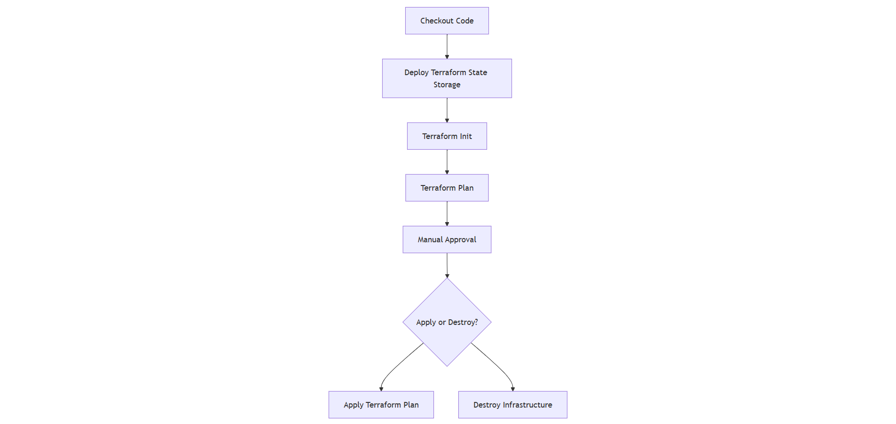

# Azure Terraform Jenkins Automation Project

This repository contains the necessary files and scripts to automate the deployment of Azure infrastructure using Terraform and Jenkins. Below is the folder structure and a detailed explanation of the pipeline flow.

## Folder Structure
```
azure-terraform-jenkins-automation-project/
├── modules/               # Contains reusable Terraform modules
├── prerequisite/          # Contains `prereq.sh` script to install Terraform, Azure CLI, and Git
├── init.sh                # Script to deploy resource group, storage account, and Terraform state container
├── main.tf                # Main Terraform configuration file
├── provider.tf            # Provider configuration for Azure
├── variables.tf           # Terraform variables definition
├── terraform.tfvars       # Terraform variable values
├── Jenkinsfile            # Jenkins pipeline script for automation
```

## Jenkins Pipeline Flow

The Jenkins pipeline automates the deployment of Azure infrastructure using Terraform. Below is the flow:

1. **Checkout Stage**: Pulls the latest code from the GitHub repository.
2. **Deploy Terraform State Storage**: Creates the resource group, storage account, and container for storing the Terraform state file.
3. **Terraform Init**: Initializes Terraform with the backend configuration for remote state storage.
4. **Terraform Plan**: Generates an execution plan and archives it for review.
5. **Manual Approval**: Waits for user approval to proceed.
6. **Apply or Destroy**: Based on user input, either applies the Terraform plan or destroys the infrastructure.

### Pipeline Flow Diagram




## Prerequisites
- Install Terraform, Azure CLI, and Git using the `prereq.sh` script.
- Configure Azure Service Principal credentials in Jenkins.

## Usage
1. Clone the repository.
2. Configure the Jenkins pipeline with the provided `Jenkinsfile`.
3. Run the pipeline to deploy or manage Azure infrastructure.

